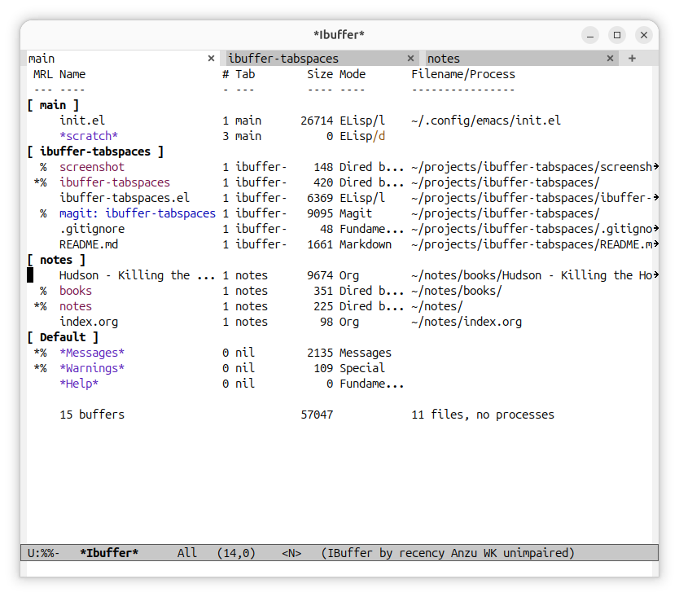

# ibuffer-tabspaces: ibuffer integration for [tabspaces](https://github.com/mclear-tools/tabspaces)



## Install

Install directly from this repo: `M-x package-vc-install RET <this repo's url>`

Using elpaca:

``` elisp
(use-package ibuffer-tabspaces
  :ensure (:host github :repo "jgangolf1/ibuffer-tabspaces")
  :after (ibuffer tabspaces))
```

## Usage

### Filters

This package defines an ibuffer filter `tabspace` which filters the buffer list by tabs. 

To narrow to a tab, or a list of tabs, `ibuffer-filter-by-tabspace`.

To narrow to the current tab, `ibuffer-tabspaces-narrow-to-tab`.

To group buffers by each tab, `ibuffer-tabspaces-group-by-tab`

These can be made default by hooking to `ibuffer-hook`: 

``` elisp
  (add-hook 'ibuffer-hook #'ibuffer-tabspaces-narrow-to-tab)
  (add-hook 'ibuffer-hook #'ibuffer-tabspaces-group-by-tab)
```
  
To open a buffer and switch tabs, `ibuffer-tabspaces-switch-buffer-and-tab`.

### Columns

This package provides two columns: `tabspace-count`, which shows the number of tabs a buffer belongs to, and `tabspace`, which shows the first tab a buffer belongs to.

Mousing over the tab column lists all tabs for the buffer in the echo area. `mouse-2` narrows to that tab.

## Example Config

Using elpaca:

``` elisp
(use-package ibuffer-tabspaces
  :ensure (ibuffer-tabspaces :host github :repo "jgangolf1/ibuffer-tabspaces")
  :after (ibuffer tabspaces)
  ;; :hook (ibuffer . ibuffer-tabspaces-narrow-to-tab) ; narrow to curren tab
  ;; :hook (ibuffer . ibuffer-tabspaces-group-by-tabs) ; group buffers by tabs
  :bind (:map ibuffer-mode-map
              ("C-<return>" . ibuffer-tabspaces-visit-buffer-switch-tab)))
```
